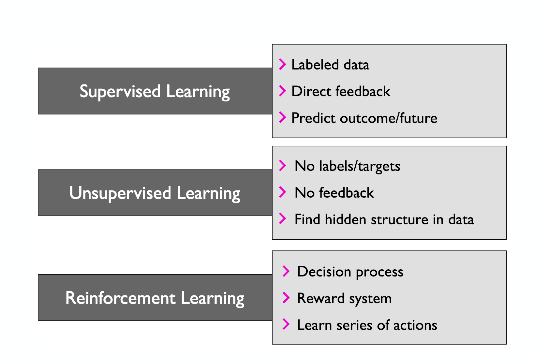

# Deep Learning #
####STAT 479##
####Instructor: Sebastian Raschka###

Some class notes put together by Scott Lucchini, Rob Morgan, and Alex Pizzuto for Sebastian Raschka's Deep Learning Class: STAT 479 at UW-Madison Spring 2019 ([github repo for the class](https://github.com/rasbt/stat479-deep-learning-ss19) and [course website](http://pages.stat.wisc.edu/~sraschka/teaching/stat479-ss2019/)).

There is no required text for the course, but “Deep Learning” by Ian Goodfellow and Yoshua Bengio and Aaron Courville (MIT Press) is strongly recommended as supplemental text.

###Introduction to Deep Learning###

AI does not necessarily have to use AI and AI does not necessarily refer to a machine learning system. However, most machine learning uses AI.

The dawn of Machine Learning was intimately related to neural networkds, with the first models being the perceptron and ADALINE, which are the building blocks for neural networks. 

It is also worth noting the different subsets of AI, there are 

* _Artificial Intelligence (AI)_: the original subfield of CS, solving tasks that humans are good at
* _Artificial General Intelligence (AGI)_: multi-purpose AI mimicking human intelligence across many tasks
* _Narrow AI_: solving a single task (like self driving cars, etc.)

So then what is _Machine Learning_?

Instead of having a programer explicitly outline a specific functionality, machine learning is the field of study that gives computres the ability to learn without being explicity programmed. Therefore, machine learning algorithms take inputs and desired outputs and design the program. Just as there are subsets of AI, there are also subsets of machine learning. Possibly the largest distinctions are:

* Supervised Learning
* Unsupervised learning
* Reinforcement learning

For further distinction, see the image below: 

####Supervised Learning####
This is often broken into classification or regression. Regression can be either regression or ordinal regression (similar to ranking, but slightly different).

####Unsupervised Learning####
Dimensionality reduction and PCA: linear transformation of the dataset that maximizes the variance along one of the dimensions of the rotated frame

Autencoders: Compressing data into a smaller subspace with fewer features but maintaining the important features (encoder), and then a layer that takes the reduces number of features to try to reconstruct the original feature 
* ex: taking a 100x100 image, compressing into a few features that take advantage of linear dependencies for storage, and then being able to decode into the original image

