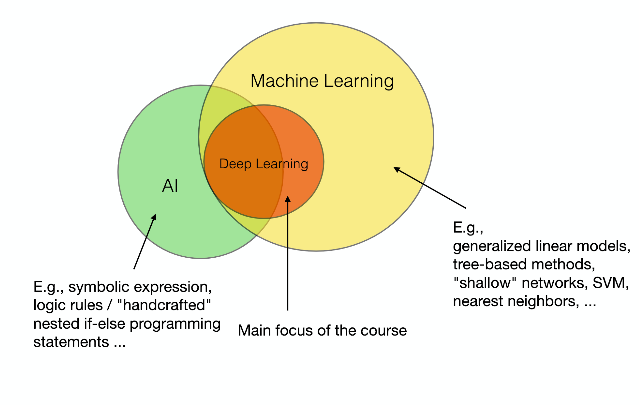

# Deep Learning #
#### STAT 479 ##
#### Instructor: Sebastian Raschka ###

Some class notes put together by Scott Lucchini, Rob Morgan, and Alex Pizzuto for Sebastian Raschka's Deep Learning Class: STAT 479 at UW-Madison Spring 2019 ([github repo for the class](https://github.com/rasbt/stat479-deep-learning-ss19) and [course website](http://pages.stat.wisc.edu/~sraschka/teaching/stat479-ss2019/)).

There is no required text for the course, but “Deep Learning” by Ian Goodfellow and Yoshua Bengio and Aaron Courville (MIT Press) is strongly recommended as supplemental text.

### Introduction to Deep Learning ###

AI does not necessarily have to use AI and AI does not necessarily refer to a machine learning system. However, most machine learning uses AI.

The dawn of Machine Learning was intimately related to neural networkds, with the first models being the perceptron and ADALINE, which are the building blocks for neural networks. 

It is also worth noting the different subsets of AI, there are 

* _Artificial Intelligence (AI)_: the original subfield of CS, solving tasks that humans are good at
* _Artificial General Intelligence (AGI)_: multi-purpose AI mimicking human intelligence across many tasks
* _Narrow AI_: solving a single task (like self driving cars, etc.)

So then what is _Machine Learning_?

Instead of having a programer explicitly outline a specific functionality, machine learning is the field of study that gives computres the ability to learn without being explicity programmed. Therefore, machine learning algorithms take inputs and desired outputs and design the program. Just as there are subsets of AI, there are also subsets of machine learning. Possibly the largest distinctions are:

* Supervised Learning
* Unsupervised learning
* Reinforcement learning

For further distinction, see the image below: 

#### Supervised Learning ####
This is often broken into classification or regression. Regression can be either regression or ordinal regression (similar to ranking, but slightly different).

#### Unsupervised Learning ####
Dimensionality reduction and PCA: linear transformation of the dataset that maximizes the variance along one of the dimensions of the rotated frame

Autencoders: Compressing data into a smaller subspace with fewer features but maintaining the important features (encoder), and then a layer that takes the reduces number of features to try to reconstruct the original feature 
* ex: taking a 100x100 image, compressing into a few features that take advantage of linear dependencies for storage, and then being able to decode into the original image

Representation learning: Similar to dimensionality reduction, one can project a higher dimensional space to a lower dimensional space while preserving each point's neighbors, then learn abou the system in the new space.

Clustering: Assigning group memberships to unlabelled data based on distances between points in the feature space.

#### Semi-Supervised Learning ####
Some training smaples contian labels and some do not. Both sets can be used to train the model.

#### Reinforcement Learning ####
Machine learning algorithm enmployed within a loop so the learning includes information from previous iterations of the run.

#### Structured vs. Unstructured Data ####

_Structured Data_: Databases, csv files, etc. Some representation of the data in tabular form.

_Unstructured Data_: Image pixels, sudio signals, text sentences, time-series data. This is the type of data we will focus on most in the course.

_Formal notation we will use_

For structured data, the feature vectors and labels can be directly read-off from the tabular format, leading to easy construction of the design matrix. For unstructured data, though, you have to define a mapping between your input data and the design matrix.

*ex: Handwritten Digits.* Images are stored as pixel values in an array with dimensions that match the shapes of the images. There are many different ways to construct features from this array, and each way will affect the performance of the algorithm. Below are some different methods of creating features:

1. Simple methods (i.e. Concatenate the pixel values in each row to a single feature). This method tends to lose some information stored in the image (i.e. information about neighboring pixels)
2. Create a data structure that an algorithm can process. We will use PyTorch to do this in this course.

#### Steps to Approaching a ML/DL Problem ####
1. Define the problem to be solved
2. Collect (labeled data)
3. Choose an algorithm class
4. Choose an optimization metric for learning the model
5. Choose a metric for evaluating the model

#### Objective Functions and Optimization Methods ####
Objective functions are usually what are optimized in step 4. Some examples include posterior probabilities, fitness functinos, total reward.value functions, information gain, log-likelihood, etc.

There are different ways to make the optimization happens. Choosing this correctly can improve both the accuaracy and efficiency of the algorithm. Some examples are combinatorial searches and greedy searches (decision trees), unconstrained conves optimization (logistic regression), constrained convex optimization (SVM), nonconvex optimization (neural nets), constrained nonconvex optimization (semi-adversarial nets).