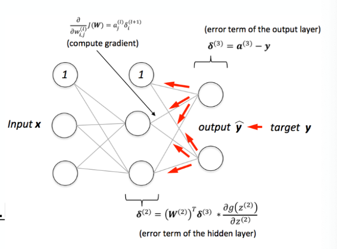

# A Brief Summary of the History of Neural Networks and Deep Learning

## Timeline

**1943:** McCulloch and Pitt's neuron model. The first mathematical formulation of a biological neuron cabable of solving AND, OR, NOT problems.

**1957:** Rosenblatt's Perceptron. The introduction of a learning algorithm built based on neutron structure. Given inputs, the perceptron applies weights to the inputs and calculates the net function input. Then using an activation function, the perceptron determines the output.

**1960:** Widrow and Hoff's ADALINE. Stands for ADAptive LInear NEuron. Introduced a continuously differentiable activation function to the Perceptron which allowed for a repeated implementation of the perceptron to converge on an optimum result.

**1969:** Minsky and Pappert tried to show that perceptrons and ADALINE learning algorithms were dead ends. The main problem was that these algorithms could not learn XOR problems (i.e. They can only learn linear decision boundaries).

Several independent researchers found they could solve the problem posed by Minsky and Pappert by adding more layers to the network, but this made the networks difficult to train. The next step in resolving this new issue was the introduction of _backpropagation_ into the algorithms.  

_Backpropagation:_ Use the results of one run of the algorithm to update the weights to be used in the next run of the algorithm. Updates are made such that an overall cost function is minimized.

**1980-present:** After the introduction of backpropagation, neural nets began to gain a lot of interest and showed success in early applications. The growing interest led to several developments during the .

- Weight sharing
- Pooling
- Convolution
- Recurrence
- Rectified Linear Units
- BatchNorm (Normalization of inputs)
- Dropout (A way of preventing overfitting)
- GANs (Generative Adversarial Networks)
- LSTMs (Long short-term memory)
- and several others

