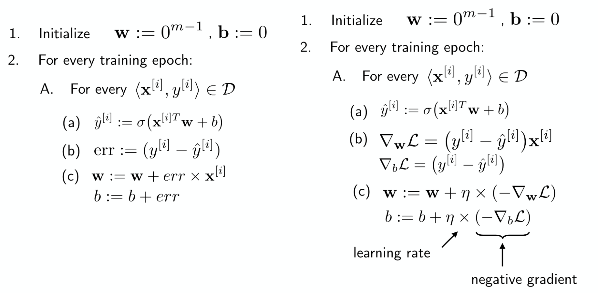

# Fitting Neurons with Gradient Descent

Thus far, our main limitation with perceptrons is that they only converge if the supplied data are linearly separable in feature space. In this lecture, the goal is to develop a new learning rule that _always_ coverges.

### Perceptron Learning Rule
Previously we iterated over the training set and for each instance:

- Computed the output based on the current weights
- Calculate the error of the output
- Update the weights by adding error to weight vector to alter decision boundaries

**Modes of learning** 
On-line Learning: We update the wieght vector based on classification error after each training instance is evaluated

On-line Learning (Alternative): Use the online method but present the training instances in random order. This process is laballed "stochastic"

Batch Learning: We determine how to update the weights after evaluating all instance in the training set. This procedure tends to be less noisy since the weights are updated less frequently, and it is also more efficient since all training samples can be evaluated simulatneously.

Minibatch Learning: This method is a mix between the above methods. Random subsets of the training set are evaluated in the "batch" style, and after each subset has been evaluated the weights are updated. 

### Linear Regression

We can apply the perceptron to the probelm of linear regression by choosing the activation function to be f(x) = x. That is, the output of the perceptron will be the net input, so we output continuous values.

Add a learning rule to this perceptron with an identity activation function, and we can hope to successfully predict the value of a continuous function.

**Least-Squares Linear Regression** 
We will use the following learning rule to approach this problem:

The left side shows how we have been traditionally thinking about the perceptron learning rule. The right side shows the exact same methodology in the framework of a more general formalism. $\mathcal{L}$ represents a "loss-function". In the case of least-squares regression, we have $$\mathcal{L} = (y^{[i]} - \hat{y}^{[i]})^2,$$ and therefore the gradient with respect to a given componenet $i$ is identical to our definition of "err" on the left side.

We can then generalize our learning rule to minimize this loss-function by adding the gradient of the loss to the weight vector. We also introduct the parameter $\eta$ to constrain the magnitude at which the weights are updated. The bias vector is updated in the same way, but by taking the gradient with respect to the bias vector rather than the weight vector.