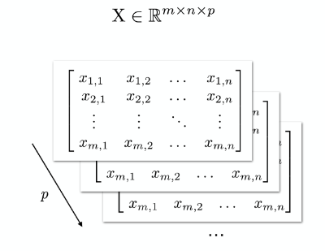
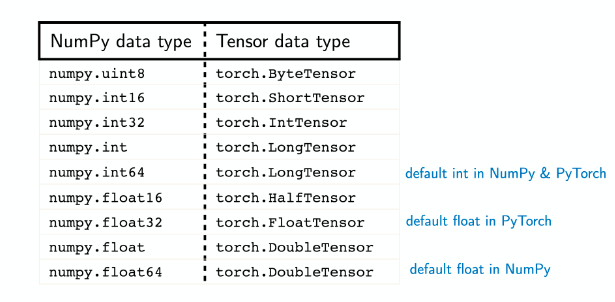
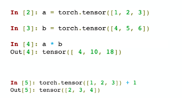
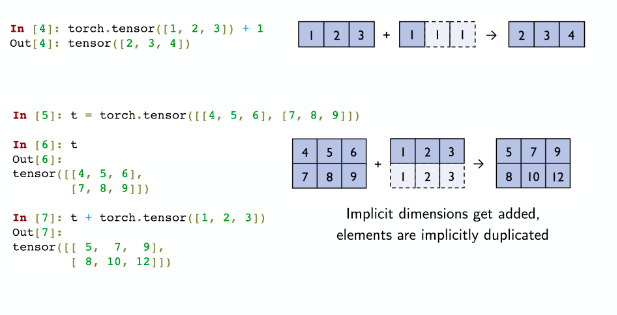
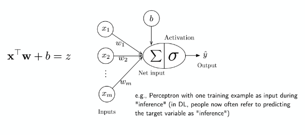
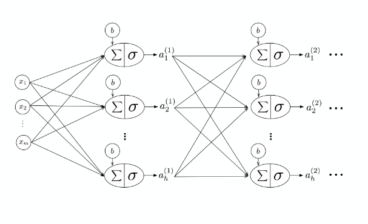
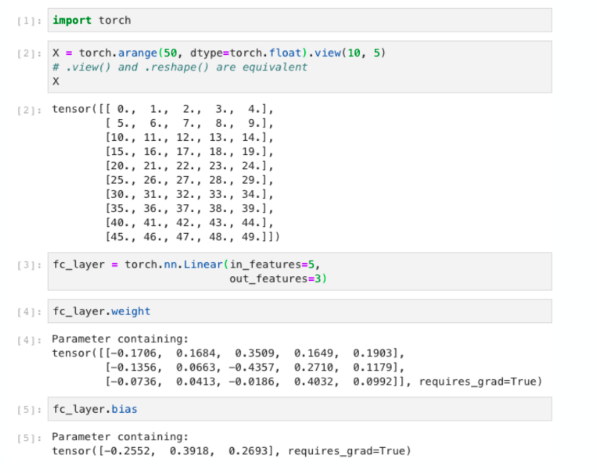

# Linear Algebra for Deep Learning

This lecture is mainly an introduction into the notation that will be used for the rest of the course.

### Tensors

Datasets typically have more than one or two features, so a basic understanding of tensors is necessary. Apologies to any mathematicians or physicists that read these notes, as we often disregard notation and formalism. 

We reserve `X` to denote the __design matrix__, or the matrix containing the traning examples and features. We typically have $$\mathbf { X } \in \mathbb { R } ^ { n \times m }$$. 

It is typically advantageous (not only for simplicity, but also for storage, to treat rank-3 tensors as stacked matrices



This scales to rank $n$ tensors (mainly for storage). 

#### Tensors in Python Modules

A `numpy.ndarray` is pretty much equivalent to a `pytorch.Tensor`. There are similar defaults for both modules, but `PyTorch` tends to be more finnicky about some type casting that `numpy` just does implicitly (ie adding `floats` to `ints`):



### `PyTorch` seems like `numpy`, so what's the point?
* `PyTorch` plays nicely with GPUs!
* `PyTorch` has automatic differentiation
* `PyTorch` implements a lot of DL convenience functions (like convolutional layers and such)

If your computer has GPUs, it's easy to load data on to said GPU, 

```python
a = a.to(torch.device('cuda:0'))
# pass back to CPU
a = a.to(torch.device('cpu'))
```

`CUDA` is the library for Deep Learning stuff on NVIDIA GPUs. 

## A Brief overview of Tensors of various ranks

### Vectors

Typically represent all vectors as column vectors. Typically, if we have an expression such as $$\mathbf { w } ^ { \top } \mathbf { x } + b = z$$, then we call $z$ the _logit_ or _net input_. 

##### Broadcasting and Element-wise operations

In `PyTorch` as in `numpy`, broadcasting is totally kosher, even though they seem to violate mathematical rules. This means addition and multiplication can be done element wise: 



But what's going on under the hood?



The modules are implicitly estimating the intended dimension of what you are trying to add, multiply, etc. 


### Matrices

It helps (in the context of this class) to think of matrices as stacks of vectors. This helps to already think about parallelizing computations. For example, matrix multiplication can be broken up into separate computations of the separate nested sums in matrix multiplication (Row 1 times vector is done simultaneously with Row 2 times vector as . . . as Row n times vector). 

Note: `view` and `reshape` in `PyTorch` are aliases, and pretty much the same as `np.reshape`.

### Notation and Connections

In general, what we have discussed can be summarized with this image 



but as we begin to stack multiple perceptrons, we get the diagram for a multi-layer perceptron (an unfortunate, but customary name):



The first layer consists of $n$ perceptrons with potentially different weight functions. This first layer outputs $n$ activations that function as training features for the next layer. In the perceptron, the $\sigma$ was the Heaviside step function. In actual multi-layer networks with other neutrons, the activation functions likely differ.

Now, the only thing that we are missing is how to find the parameters (_learning rule_) and proper threshold functions. 

When referring to weights, $w_{i,j}$, $j$ refers to the input position and $i$ refers to the output poisition.

##### A brief note on dimensionalities

Suppose you take a dataset with $n$ samples each with $m$ features ($n \times m$). Then in general, the first layer will have $h$ perceptrons that take each of the $m$ features, ($m \times h$), so after the first layer, you will have a new feature matrix that is $n \times h$, in other words, each of $n$ samples has $h$ new transformed feature variables that can be used to make a classification or for another layer of learning. 

#### Layers in `PyTorch`

It is very simple to take the layer we have written in native python and convert to `pytorch`. The `nn.Linear` layer stores `weight` vectors and `bias` as class attributes. 



