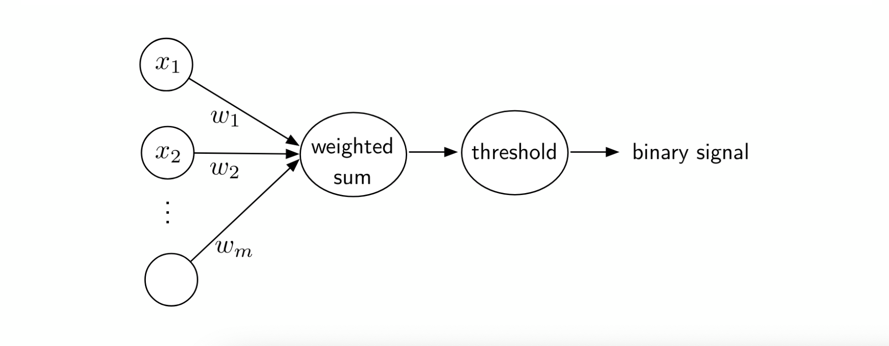

# An Introduction to Single-Layer Neural Networks

## The Perceptron

The overall structure of the perceptron is to weight an instnace's features by a set of factors, determine a weighted sum, and make a decision based on the comparison to the wieghted sum to a threshold value.

Now in order to determine the optimum weights for a dataset, a learning algorithm has to be introduced to the structure of the perceptron.

### Learning Algorithm

With the current weights, classify an instance in the training set. If the classification is correct, do nothing. If the classification is incorrect, then we need to adjust the weights.

- Scenario A: If the output is 0 and the class label is 1, _add_ the input vector to the weight vector.
- Scenario B: If the output is 1 and the class label is 0, _subtract_ the input vector from the weight vector.

This algorithm is guarenteed to converge to a solution as long as a linear decision boundary exists between the two classes. if this highly idealized situation is not the case, then you must incorporate a maximum number of iterations to avoid an infinite loop.

See the [lecture notes](https://github.com/rasbt/stat479-deep-learning-ss19/blob/master/L03_perceptron/L03_perceptron_slides.pdf) for a proof of the perceptron's convergence.

### Summary

- Linear classifier, no non-linear decision boundaries are possible
- Binary classifier, cannot solve XOR problems
- Does not converge if classes are note linearly separable
- Many optimal solutions can exist in terms of the way we characterized the misclassification cost in this lecture, but most of these solutions will not be optimal in terms of generalizations to unseen data

