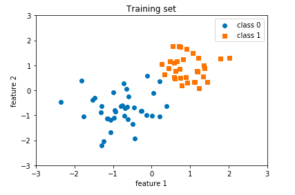
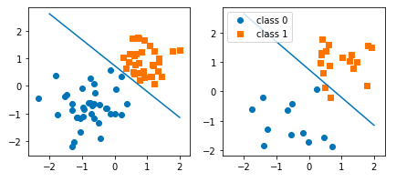
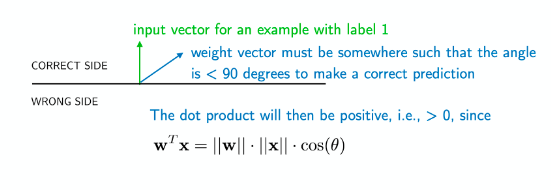
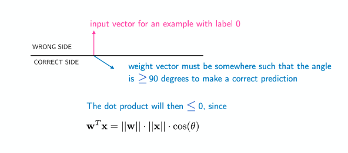
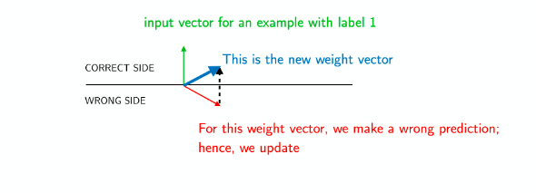

# An Introduction to Single-Layer Neural Networks

## The Perceptron

The overall structure of the perceptron is to weight an instnace's features by a set of factors, determine a weighted sum, and make a decision based on the comparison to the wieghted sum to a threshold value.


Now in order to determine the optimum weights for a dataset, a learning algorithm has to be introduced to the structure of the perceptron.

### Learning Algorithm

With the current weights, classify an instance in the training set. If the classification is correct, do nothing. If the classification is incorrect, then we need to adjust the weights.

- Scenario A: If the output is 0 and the class label is 1, _add_ the input vector to the weight vector.
- Scenario B: If the output is 1 and the class label is 0, _subtract_ the input vector from the weight vector.

This algorithm is guarenteed to converge to a solution as long as a linear decision boundary exists between the two classes. if this highly idealized situation is not the case, then you must incorporate a maximum number of iterations to avoid an infinite loop.

See the [lecture notes](https://github.com/rasbt/stat479-deep-learning-ss19/blob/master/L03_perceptron/L03_perceptron_slides.pdf) for a proof of the perceptron's convergence.

### Summary

- Linear classifier, no non-linear decision boundaries are possible
- Binary classifier, cannot solve XOR problems
- Does not converge if classes are note linearly separable
- Many optimal solutions can exist in terms of the way we characterized the misclassification cost in this lecture, but most of these solutions will not be optimal in terms of generalizations to unseen data

## Perceptron, day 2

Today is pretty much just coding up a first example of a perceptron. Code is taken almost directly from [Sebastian's github](https://github.com/rasbt/stat479-deep-learning-ss19/blob/master/L03_perceptron/code/perceptron-numpy.ipynb). We are using a toy dataset with two features and equally proportioned class labels. 



And we note that there does exist a linear boundary between the two classes, so the perceptron should be able to converge. We start bybuilding a class:

```python
class Perceptron():
    def __init__(self, num_features):
        self.num_features = num_features
        self.weights = np.zeros((num_features, 1), dtype=np.float)
        self.bias = np.zeros(1, dtype=np.float)

    def forward(self, x):
        linear = np.dot(x, self.weights) + self.bias
        predictions = np.where(linear > 0., 1, 0)
        return predictions
        
    def backward(self, x, y):  
        predictions = self.forward(x)
        errors = y - predictions
        return errors
        
    def train(self, x, y, epochs):
        for e in range(epochs):
            
            for i in range(y.shape[0]):
                errors = self.backward(x[i].reshape(1, self.num_features), y[i]).reshape(-1)
                self.weights += (errors * x[i]).reshape(self.num_features, 1)
                self.bias += errors
                
    def evaluate(self, x, y):
        predictions = self.forward(x).reshape(-1)
        accuracy = np.sum(predictions == y) / y.shape[0]
        return accuracy
```

Sebastian points out that an entire class definition for a perceptron might be overkill, but it will help for future PyTorch applications. 

The `forward()` method just outputs the prediction, it applies the already weighted `Perceptron`. The `backward()` method is a kind of error signal that propagates to correct an improperly assigned class label.

The `train()` method is where most of the content is. You loop over the training set, each time getting a prediction and updating the weights for incorrect predictions. 

`evaluate()` is just there for convenience to output the accuracy of the `Perceptron` with the current weights. 

Note: `np.reshape()` is a way to flatten multi-dimensional arrays. 

### Perceptron Performance

For the given dataset, the perceptron performs _reasonably_ well for different numbers of iterations (if I have time, I'll plot out what this looks like for a bunch of different numbers of iterations):



Because of the linear seperability, the perceptron does a perfect job on the training set (left), but does not do perfectly for the test set because of the points near the boundary. This could be fixed with a little bit of cross-validation. 

## Perceptron: Proof of Convergence

A quick note: Perceptron's don't guarantee the __best__ solution in the case of linearly seperability, just one of them. For the best, you might consider a more sophisticated method (ie a Support Vector Machine), but these tend to scale unfavorably computationally, and that is the advantage of neural nets.

Geometrically, the proof hinges on the existence of a decision boundary. In this case, the weight vector is perpendicular to the decision boundary. This scales to $n$-dimensions, i.e. if there exists a hyperplane decision boundary that perfectly classifies, then the weight vector will be orthogonal to the decision hyperplane. 





One thing to note about many linear classifiers. Typically, they scale as $\mathcal{O}(n^2)$ because you must create distance matrices for all of the samples in your feature space. Deep learning algorithms typically scale sub-quadratically with sample size.

### Analogy to Future Lectures

Perceptron learning is similar to least-squares regression. The perceptron optimizes a loss function, and if we set that equal to the gradient of our mean squared error function, then we get least-squares regression. 

Another thing to note is that with a step function, taking the gradient leads to a $\delta$-function, something that doesn't play too nicely with our definitions, so we treat it as not differentiable. 

## Homework 1 class discussion

Homework 1 is just replacing this `python` code with built-in python methods, and no python modules. This was my attempt at trying to finish it before the end of class: 

```python
class Perceptron():
    def __init__(self, num_features):
        self.num_features = num_features
        self.weights = [0.] * num_features
        self.bias = [0.]
        
    def dot(a, b):
	    try:
	        dotsum = 0
	        for i, j in zip(a,b):
	            dotsum += i*j
	        return dotsum
	    except:
	        return 0

    def forward(self, x):
        linear = dot(x, self.weights) + self.bias
        predictions = []
        for j in linear:
        	if j > 0.:
        		predictions.append(1.)
        	else:
        		predictions.append(0.)
        return predictions
        
    def backward(self, x, y):  
        predictions = self.forward(x)
        errors = []
        for j, k in zip(y, predictions):
        	errors.append(j - k)
        return errors
        
    #Class ended here, so I didn't get to convert it all to native python
    def train(self, x, y, epochs):
        for e in range(epochs):
            
            for i in range(y.shape[0]):
                errors = self.backward(x[i].reshape(1, self.num_features), y[i]).reshape(-1)
                self.weights += (errors * x[i]).reshape(self.num_features, 1)
                self.bias += errors
                
    def evaluate(self, x, y):
        predictions = self.forward(x).reshape(-1)
        accuracy = np.sum(predictions == y) / y.shape[0]
        return accuracy
```